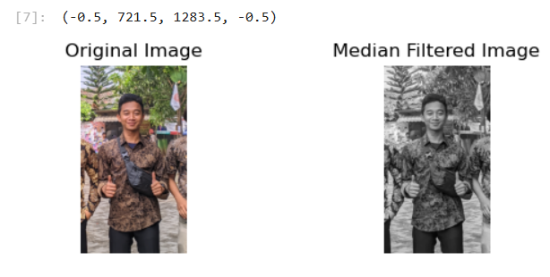
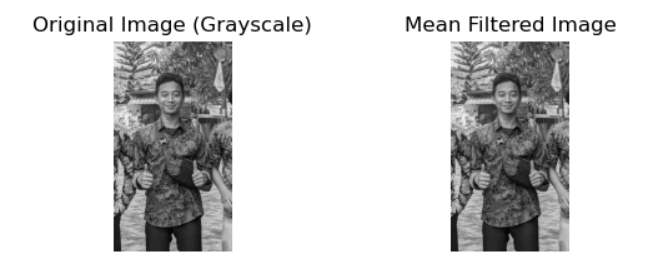

`git clone https://github.com/dyzulk/PA-PC_202231120_MUHAMMAD-HERDY-ISKANDAR.git`

# Penjelasan Kode

Kode ini terdiri dari beberapa bagian: mengimpor pustaka, membaca dan mengonversi gambar, menerapkan filter median dan mean, dan menampilkan hasilnya:

## 1) Impor library
```
import cv2  
import numpy as np  
import matplotlib.pyplot as plt
```
`cv2`: Perpustakaan OpenCV untuk tugas visi komputer.             
`numpy`: Perpustakaan untuk operasi numerik.  
`matplotlib.pyplot`: Perpustakaan untuk merencanakan gambar.

## 2) Baca dan Konversi Gambar
```
image_path = "FOTOdiri.jpg"
image = cv2.imread(image_path)
image_gray = cv2.cvtColor(image, cv2.COLOR_BGR2GRAY)
```
`image_path`: Jalur ke file gambar.
`image`: Baca gambar menggunakan OpenCV.
`image_gray`: Ubah gambar menjadi skala abu-abu

## 3) Terapkan Filter Median
```
median_filtered = cv2.medianBlur(image_gray, 5)
```
`median_filtered`: Terapkan median blur ke gambar skala abu-abu dengan ukuran kernel 5.

## 4) Tentukan Fungsi Filter Rata-rata
```
def mean_filter(image):
    kernel = np.ones((3, 3), np.float32) / 9
    mean_filtered_image = cv2.filter2D(image, -1, kernel)
    return mean_filtered_image

mean_filtered = mean_filter(image_gray)
```

`mean_filter(image)`: Berfungsi untuk menerapkan filter rata-rata pada gambar.
`kernel`: Filter rata-rata 3x3.
`mean_filtered_image`: Gambar yang dihasilkan setelah menerapkan filter mean.

## 5) Tampilkan Gambar
```
plt.figure(figsize=(15, 10))

# Original Image
plt.subplot(2, 2, 1)
plt.imshow(cv2.cvtColor(image, cv2.COLOR_BGR2RGB))
plt.title('Original Image')
plt.axis('off')

# Median Filtered Image
plt.subplot(2, 2, 2)
plt.imshow(median_filtered, cmap='gray')
plt.title('Median Filtered Image')
plt.axis('off')

# Original Image (Grayscale)
plt.subplot(2, 2, 3)
plt.imshow(image_gray, cmap='gray')
plt.title('Original Image (Grayscale)')
plt.axis('off')

# Mean Filtered Image
plt.subplot(2, 2, 4)
plt.imshow(mean_filtered, cmap='gray')
plt.title('Mean Filtered Image')
plt.axis('off')

plt.show()
```

`plt.figure(figsize=(15, 10))`: Membuat gambar dengan ukuran tertentu.  
`plt.subplot(2, 2, 1)`: Membuat subplot (2 baris, 2 kolom, posisi 1).   
`plt.imshow()`: Menampilkan gambar.   
`plt.title()`: Tetapkan judul subplot.    
`plt.axis('off')`: Menyembunyikan sumbu.    
`plt.show()`: Menampilkan semua subplot.


## Hasil
Skrip menampilkan empat gambar:

Gambar Asli berwarna.
Median Gambar yang Difilter dalam skala abu-abu.    
    
Gambar Asli dalam skala abu-abu.    
Berarti Gambar yang Difilter dalam skala abu-abu.    
    
